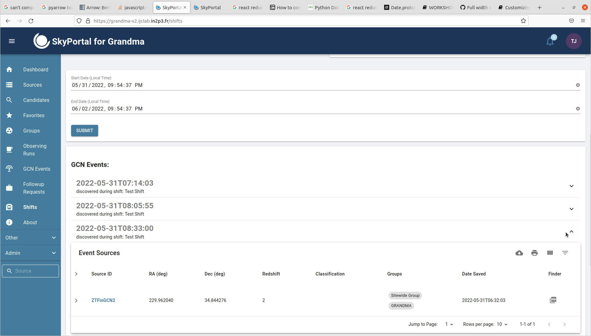
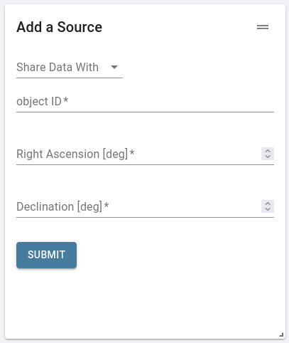
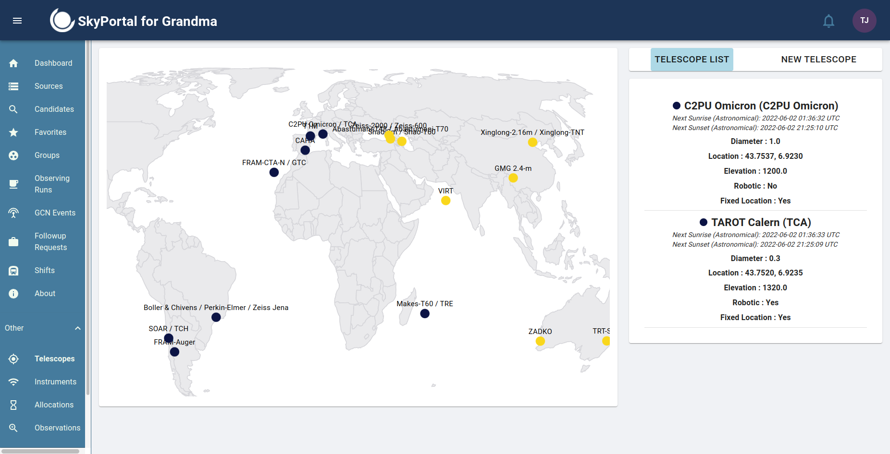
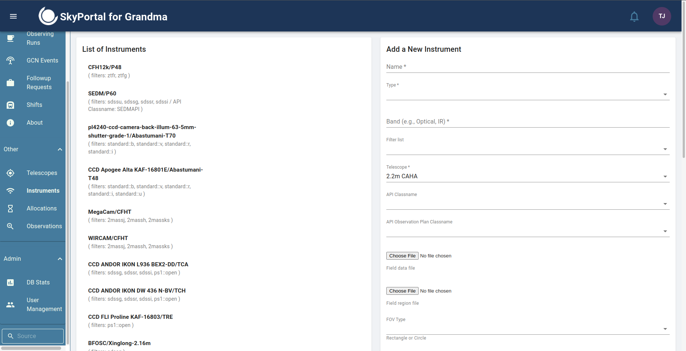

# WORKSHOP exerciseS

### **Here, you will find a series of short and concise exercises to help you get started with SkyPortal for GRANDMA. Also, this will help us verify that everyone created their account and participated in the exercises. Additionally, it will help you find potential bugs so we can fix them!**
### At the end of the exercises, you will find a short Google Form to give us feedback about your experience. This step is mandatory and will help us a lot to make the platform better for everyone.
### **Thank you for your participation!**

### Exercises:

**Step 1**. Go to the Shift page: [https://grandma-v2.ijclab.in2p3.fr/shifts/](https://grandma-v2.ijclab.in2p3.fr/shifts/), and on the calendar click on the **Test Shift** (hint: it's second one on Tuesday). Now, on the right part of the screen, you should see the menu of the shift.

Shift Page            | Shift Menu |
:-------------------------:|:-------------------------:|
  |  |

**Step 2**. Now that you selected the shift, on the Shift menu on the right part of your screen, click on the **join** button. Right after, you should be able to see your name in the *members* list, and the shift should now be green instead of blue on the calendar. That means that you are now a member of this shift ! You will also receive a notification (the bell on the top right hand corner) saying that you have joined the shift.

|  Updated shift calendar |
:-------------------------:|
  |

**Step 3**. Now that you are a shifter, let's leave a comment on your shift ! To do that, you can write a comment on the element that is right under the Shift Menu (on the right part of your screen). Simply add a comment that says "Hi, I'm `your_full_name` and I just completed exercise 3 !", then click on the **Add Comment** button.

Add a Comment on shift             |
:-------------------------:|
  |

**Step 4**. Now, go to the bottom of the page. Here, you find the list of GCN Events that happened during the shift you selected. You should see quite a few of them. During this exercise, we will interact with the one that happened at 08:33:00 UTC (it is fake, created only for this exercise, but the other ones are real events). Click on the GCN Event (**not the name, but the box in which it is contained, or on the arrow on the right its right**). You should be able to see the list of sources that are contained in the most recent localization of the GCN Event. If all goes well, you should see a single source called **ZTFinGCN2**.

List of GCN Event that happend during a shift            |
:-------------------------:|
  |

**Step 5**. In this exercise and the next, you will be able to interact with the Source that is contained in that event. Right Click on the **ZTFinGCN2** source (on its name) and open the page in a new tab or window, you will be redirected to the Source page associated to this source. On the Source Page, you will find several information about the source and tools to interact with it. Let's start by something you already mastered: leaving a comment just like we did on the Shift Page. Leave a comment that says: "Hi, I'm `your_full_name` and I just completed exercise 5 !", then click on the **Add Comment** button.

Source Page              |  Add a Source Comment
:-------------------------:|:-------------------------:
  |  

**Step 6**. Now, let's add a classification for that source. You'll find the Classification element right below the list of comments. Here, you'll have to choose a group to which the classification will be associated. **Select the group "GRANDMA"**, then choose a taxonomy. A taxonomy contains a hierarchy of different classifications. You should see 2 of them: *Sitewide* and *Fink*. For this exercise, lets use the **Fink Taxonomy** (additional information: this taxonomy contains the classifications given by Fink alerts). Then choose the classification of your choice. Last step will be to choose a probability, you can also choose the value you want, and then click on the **Submit** button.

Add a Classification             |
:-------------------------:|
  |

**Step 7**. Now, let's do the last exercise on the Source Page. As you can see on that page, there is a photometry plot (lightcurve). You can easily add photometry points by clicking on the **Upload additional photometry** button. A pop-up will appear, where you'll be able to enter data in a tabular/csv format, in the same way as you had to do during the last GRB Campaign. Example data will be given, you can simply follow the instructions.
**Please use mjd values around 59725±15 (around today's date basically), just to make sure that it is easily visible on the plot and that points are not too far away from each other.**
You will also have to choose an instrument. To know if the instrument you choose has the filters you've written in the text input, simply hover its name. When you are satisfied with your data, click on the **preview** button to verify it. Then, scroll to the bottom of the page and click on the **Submit** button. Now, you can go back to the Source Page and see your new photometry points on the plot ! (we advise to use magnitude values between 13 and 15 to be sure that you will see them appear next to the points that already exist on the plot, this is only to make the exercise easier, but any value could be used).

Photometry plot              |  Pop-up window to add additional photometry
:-------------------------:|:-------------------------:
  |  

**Step 7.5 (optional, mostly for observers)**. If you want to try adding **REAL** photometry to the platform, you can try ! Simply go back to the dashboard. There, you will find a form to add a new source (bottom right hand corner). Create a new source with the name you want, and then go to its source page. You can type its name on the *source* text input field (the text field on the bottom of the navbar, not the Source menu that is on the top of it) on the nav bar on the bottom left hand corner of the screen, or look for it on the Source List Menu (this time the menu on the top of the navbar). Once you are on its page, thumbnails will be generated, which might take some time. Now, follow the same steps as in exercise 7 to add photometry points to the plot !

Form to add a Source on the dashboard              |  Text field to search for a source by its name on the navbar | Source List Menu (click on *source* on the navbar)
:-------------------------:|:-------------------------:|:-------------------------:
  |  |  

**Step 8**. Let's go back to the tab where you had the Shift Page open (or just click on the Shift Page again if you closed it by accident, then select the Test Shift again). Go back to the bottom of the page where you found the GCNEvent. Again, click on the event that happened at 08:33:00, **but this time click directly on its Name** and not next to it, to be redirected to the page of the event. Here, you will find information about the event as well as a form where you can select which localization to use when displaying the rest of the data (like the sources, observations and galaxies contained in it), and other elements to plan observations and such.
Let's start by doing the same as we did for the shifts and sources: adding a comment ! This time, leave a comment that says: "Hi, I'm `your_name` and I just completed exercise 8 !", then click on the **Add Comment** button.

GCN Event Page              |  Add a Comment on GCN
:-------------------------:|:-------------------------:
  |  

**Step 9**. Now, go to the form and select **localization** and **sources**. Then, maintain a left click on the globe (it is a Skymap) and move your mouse to rotate it. You should be able to visualize the localization as well as the source(s) that can be found inside of it.

GCN Skymap             |
:-------------------------:|
  |

**Step 10**. This will be the last exercise on the Shift Page. Go back to the Shift Page, select the shift you had selected earlier, then click on the **leave** button. The shift should go back to being blue on the calendar, and your name should disappear from the list of members.

Shift Menu - leave the shift             |  Updated Shift Page
:-------------------------:|:-------------------------:
  |  

**Step 11 (Telescope teams only)**. Please go to the Telescopes Page by clicking on "Other" in the navbar, then click on **Telescopes**. There, please look for your respective telescope(s). When you find it on the map, please click on it (click on the marker right below its name. As some telescopes are really close to each other, feel free to zoom slightly to be sure to click on the correct marker) and some informations should appear on the right part of the page, in the Telescope List menu. Please verify that the data is correct. If you don't find your telescope on the map or if the data is incorrect, please contact us directly and send us the right information. You can reach out to us on [Slack GRANDMA](https://app.slack.com/client/TFRQJA3CJ) (@Thomas Culino @Theophile Jegou du Laz).

You can do the same for the Instruments Page by clicking on "Other" in the navbar, then click on Instruments. You will see the list of all instruments on the left part of the screen. If you don't find the instrument(s) of your telescope(s) or if the data is incorrect, please contact us directly and send us the right information. You can reach out to us on [Slack GRANDMA](https://app.slack.com/client/TFRQJA3CJ) (@Thomas Culino @Theophile Jegou du Laz).

Telescopes Page            | Instruments Page |
:-------------------------:|:-------------------------:|
  |  |

#### Congratulations ! You completed all of the exercises ! You are now an expert of SkyPortal :) Don't hesitate to explore the platform some more, there are many other features we did not explore yet. For the comfort of other users that did not complete their exercises yet, please do not make further edits on any of the shifts, gcn events, sources, telescopes and instruments you explored during the exercises. But feel free to have fun on any other gcn events and sources ! :) Also, we strongly encourage you to try the Candidate Page.

## MANDATORY: [Feedback form](https://forms.gle/tdK645qVKQG6SNe88)

### Enjoy the rest of the workshop ! Thanks for trying SkyPortal for GRANDMA
