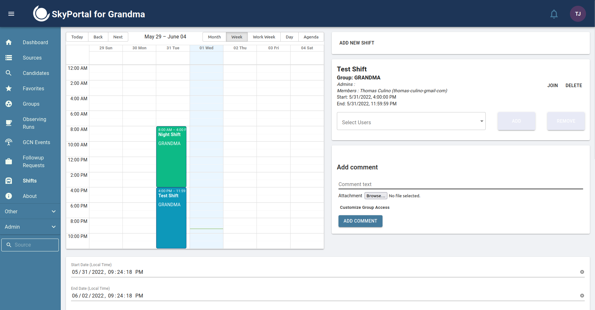
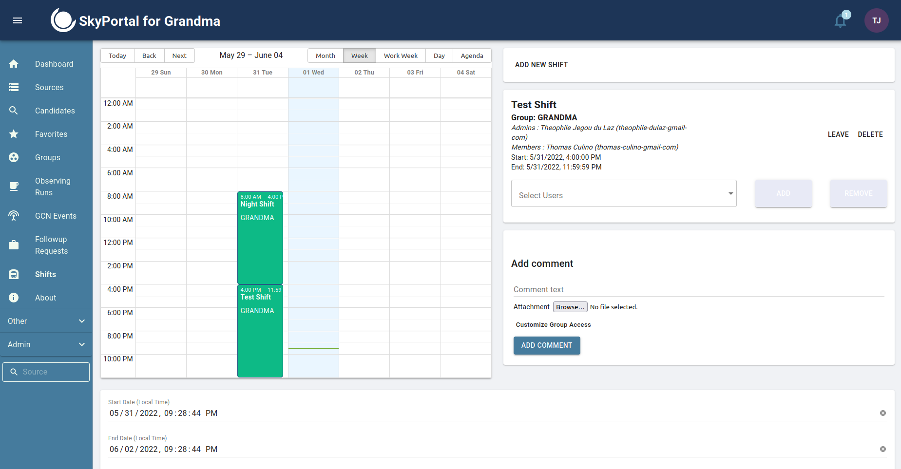
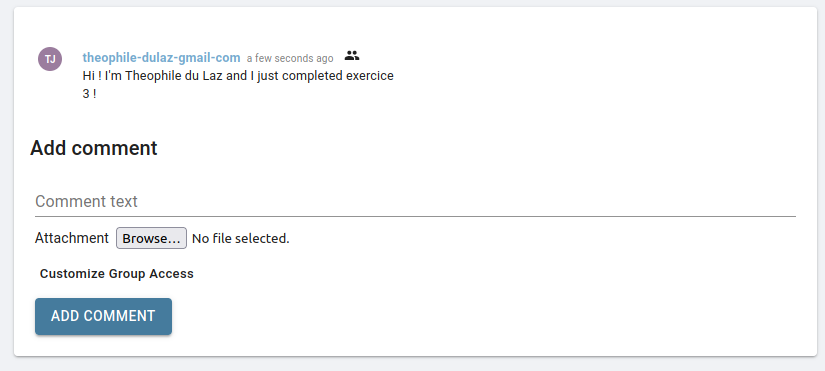
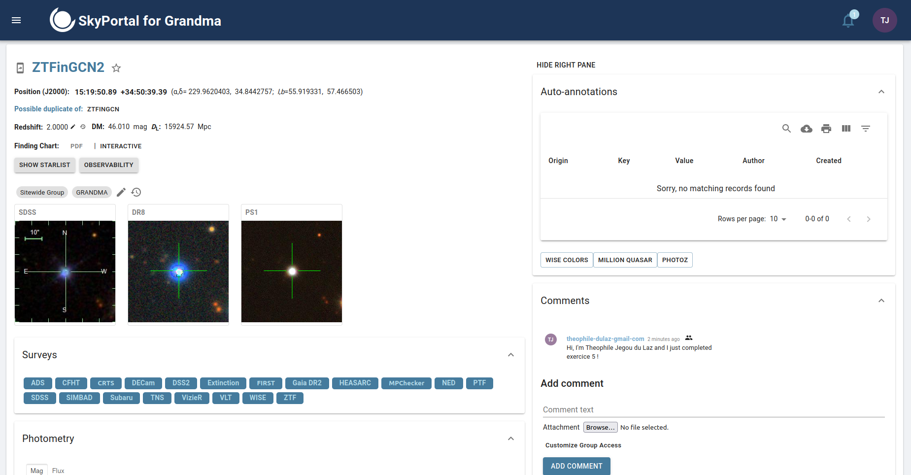
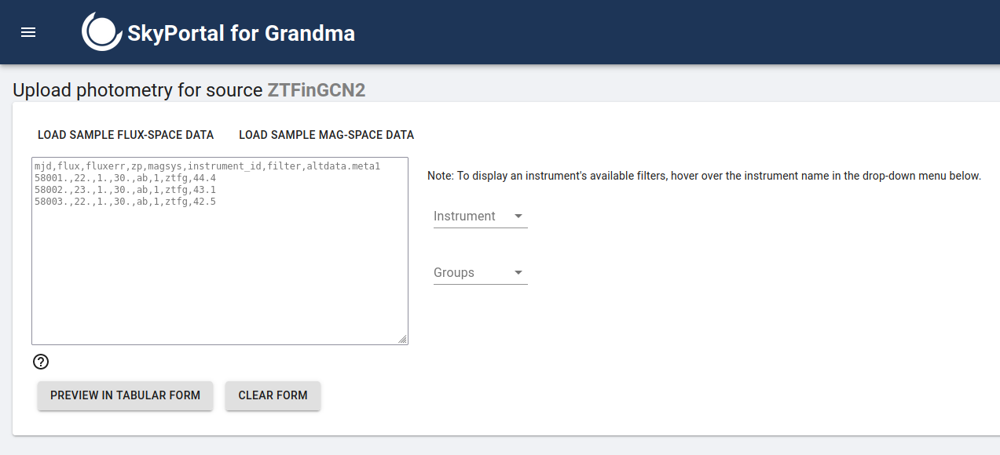
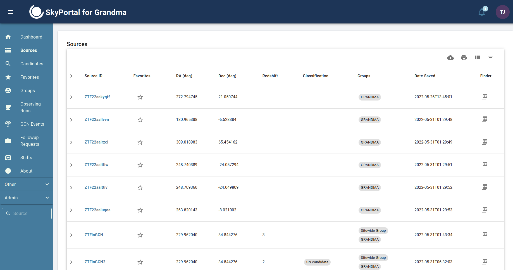
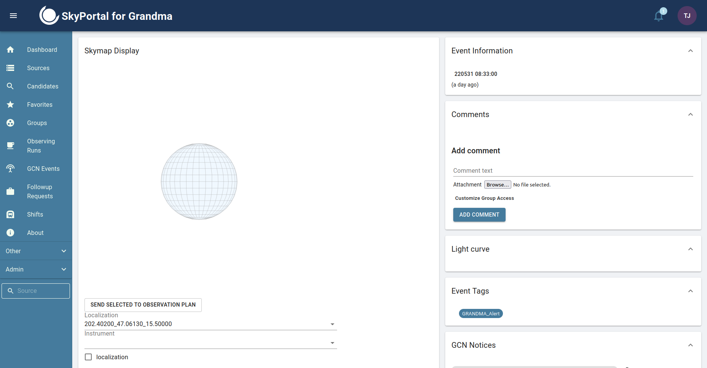
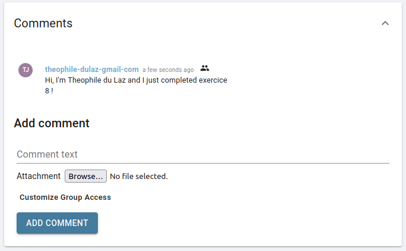

# WORKSHOP EXERCICES

### **Here, you'll find a series of short and concise exercices to help you get started with SkyPortal for GRANDMA.**
### **Also, this will help us verify that everyone created their account and participated in the exercices, and it will help you find potential bugs so we can fix them!**
### **Thank you for your participation!**

#### The exercices will be focused on the Shift feature, but will make you explore some other core features of SkyPortal.

### Exercices:

**Step 1**. Go to the Shift page: [https://grandma-v2.ijclab.in2p3.fr/shifts/](https://grandma-v2.ijclab.in2p3.fr/shifts/), and on the calendar click on the **Test Shift** (hint: it's second one on Tuesday). Now, on the right of the screen, you should see the menu of the shift.

Shift Page            |
:-------------------------:|
  |

**Step 2**. Now that you selected the shift, on the Shift menu on the right part of your screen, click on the **join** button. Right after, you should be able to see your name in the *members* list, and the shift should now be green instead of blue on the calendar. That means that you are now a member of this shift ! You will also receive a notification (the bell on the top right hand corner) saying that you have joined the shift.

Shift Menu - Join Button              |  Updated shift calendar
:-------------------------:|:-------------------------:
  |  

**Step 3**. Now that you are a shifter, let's leave a comment on your shift ! To do that, you can write a comment on the CommentList element that is right under the Shift Menu (on the right of your screen). Simply add a comment that says "Hi, I'm <your_name> and I just completed exercice 3 !", and click on the **Add Comment** button.

Add a Shift Comment             |
:-------------------------:|
  |

**Step 4**. Now, go to the bottom of the page. Here, you find the list of GCN Events that happened during the shift you selected. You should see quite a few of them. During this exercice, we will interact with the one that happened at 08:33:00 UTC. Click on the GCN Event (**not the name, but the box in which it is contained, or on the arrow on the right of it**). You should be able to see the list of sources that are contained in the most recent loxalization of the GCN Event. If all goes well, you should see a single source called **ZTFinGCN2**.

List of GCN Event that happend during a shift            |
:-------------------------:|
  |

**Step 5**. In this exercice and the next, you will be able to interact with the Source that is contained in that event. Right Click on the **ZTFinGCN2** source (on its name) and open the page in a new tab or window, you will be redirected to the Source page. On the Shift Page, you will find several information about the source and tools to interact with it. Let's start by leaving a comment just like we did on the Shift Page. Leave a CommentList that says: "Hi, I'm <your_name> and I just completed exercice 5 !", and click on the **Add Comment** button.

Source Page              |  Add a Source Comment
:-------------------------:|:-------------------------:
  |  

**Step 6**. Now, let's add a classification for that source. You'll find the Classification element right below the CommentList. Here, you'll have to choose a group to which the classification will be associated. **Select the group "GRANDMA"**, then choose a taxonomy. A taxonomy contains a hierarchy of different classification. You should see 2 of them: Sitewide and Fink. For this exercice, lets use the Fink Taxonomy (additionnal information: this taxonomy contains the classifications given by Fink alerts). Then choose the classification of your choice. Last step will be to choose a probability, you can also choose the value you want, and then click on the **Submit** button.

Add a Classification             |
:-------------------------:|
  |

**Step 7**. Now, let's do that last exercice on the Source Page. As you can see on that page, there is a photometry plot. You can easily add photometry points by clicking on the **Upload additional photometry** button. A pop-up will appear, where you'll be able to enter data in a tabular/csv format, in the same way as you had to do during the last GCB Campaign. Example data will be given, you can simply follow the instructions. You will also have to choose an instrument. To know if the instrument you choose has the filters you've written in the text input, simply hover its name. When you are satisfied with your data, click on the **Submit** button. Now, you can go back to the Source Page and see your new photometry points on the plot ! (we advise to use magnitude values between 13 and 15 to be sure that you will see them appear next to the points that already exist on the plot).

Photometry plot              |  Pop-up window to add additional photometry
:-------------------------:|:-------------------------:
  |  

**Step 7.5 (optional)**. If you want to try adding **REAL** photometry to the platform, you can try ! Simply go back to the dashboard. There you'll find a small form to add a new source (bottom right hand corner). Create a new source with the name you want, and then go to its source page. You can type it's name on the *source* field (the text field, not the Source menu) on the nav bar on the left of the screen, or look for it on the Source List Menu (this time the menu on the navbar). Once you are on it's page, thumbnails will be generated, which might take some time. Now, follow the same steps at in exercice 7 to add photometry points to the plot !

Form to add a Source on the dashboard              |  Text field to search for a source by its name on the navbar | Source List Menu (click on *source* on the navbar)
:-------------------------:|:-------------------------:|:-------------------------:
  |  |  

**Step 8**. Let's go back to the tab where you had the Shift Page open (or just click on the Shift Page again if you closed it by accident). Go back to the bottom of the page where you found the GCNEvent. Again, click on the event that happened at 08:33:00, but this time click on its Name not next to it to be redirected to the page of the Event. Here, you'll find informations about the event as well as a form where you can select which localization to use, and other elements to plan observations and such.
Let's do that same as we did for the shifts and sources: adding a comment ! This time, leave a comment that says: "Hi, I'm <your_name> and I just completed exercice 8 !", and click on the **Add Comment** button.

GCN Event Page              |  Add a GCN Comment
:-------------------------:|:-------------------------:
  |  

**Step 9**. Now, go to the form and select **localization* and *sources*. Now, maintain a left click on the globe and move your mouse to rotate it. You should be able to visualize the localization as well as the source that can be found inside of it.

GCN Skymap             |
:-------------------------:|
  |

**Step 10**. Go back to the Shift Page, select the shift you had selected earlier, and click on the **leave** button. The shift should go back to being blue on the calendar, and your name should have disappeared from the list of members.

Shift Menu - leave the shift             |  Shift Page
:-------------------------:|:-------------------------:
  |  

#### Congratulations ! You completed all of the exercices ! Don't hesitate to explore the platform some more. For the comfort of other users that did not complete their exercices yet, please do not do anything on any of the shifts, gcn events and sources you explored during the exercices. But feel free to have fun on any other gcn events or sources ! :)

### Enjoy the rest of the workshop ! Thanks for trying SkyPortal for GRANDMA
